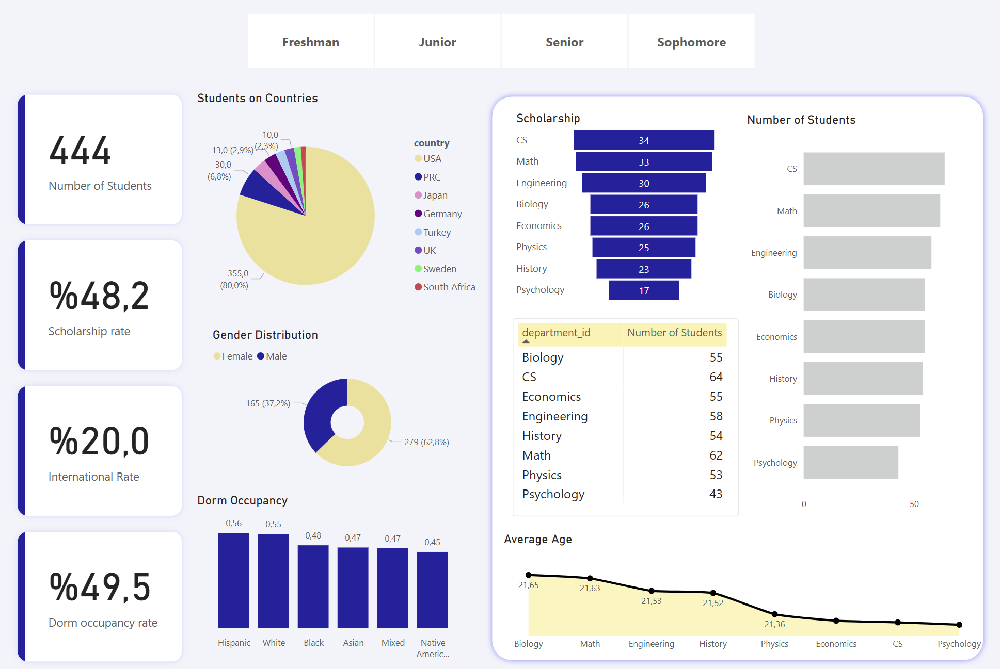

# 🎓 University Student Dashboard – Power BI Project

-This project is a fully interactive Power BI dashboard built to explore and analyze university student data from multiple angles: academic, demographic, financial, and housing. The goal is to provide actionable insights for departments like Admissions, Student Affairs, and Housing Services.

---

## 📊 Dashboard Overview

The dashboard presents key student metrics and interactive visualizations, including:

The dashboard includes the following visual elements:

🎯 Funnel Chart – Scholarship Distribution
Used to visualize how scholarship coverage drops across departments. It clearly shows which departments have more or fewer students receiving financial aid.

📋 Table + Bar Chart – Number of Students by Department
A combined visual showing exact student counts in a table and trends across departments using a bar chart. This helps quickly compare department sizes.

📈 Stacked Area Chart – Average Age by Department
Demonstrates how the average student age varies among departments over time or in comparison. This is useful for identifying maturity level or graduate presence.

📊 Column Chart – Dorm Occupancy Rate by Race
Highlights how dorm usage varies between different racial groups. Helps the housing department assess inclusion and demand distribution.

🍩 Donut Chart – Gender Distribution
Shows the proportion of male and female students. A quick view of gender balance across the university.

🧭 Pie Chart – Country Distribution
Displays how many students come from different countries, emphasizing international diversity versus domestic enrollment.

---

## 🎯 Business Objectives

This dashboard was designed to help answer questions like:

- How are scholarships distributed across academic departments?
- What is the gender and racial diversity of the student population?
- How many students live in dormitories by race?
- How does average age vary by department?
- Which cities or countries are students coming from?

---

## 🧠 Stakeholder Goals

The dashboard supports key stakeholder needs:
- **Admissions Office:** Understand demographic trends and geographic diversity.
- **Student Affairs:** Track class levels, dorm usage, and diversity metrics.
- **Finance Department:** Monitor scholarship distribution effectiveness.

---

## 🛠️ Technologies Used

- **Power BI Desktop**
- **Microsoft Excel** (data source)
- **DAX** (calculated KPIs and metrics)
- **UI/UX Design:** Modern, minimal, responsive layout using color-coded cards and charts

---

## 👩‍💻 Author

Selin Karol  
Software Engineer & Data Enthusiast  
[LinkedIn](https://www.linkedin.com/in/selin-karol-891k/))

---

## ⚠️ Disclaimer

This project uses synthetic (dummy) data and does not contain real student records. It is intended for educational and portfolio use only.
